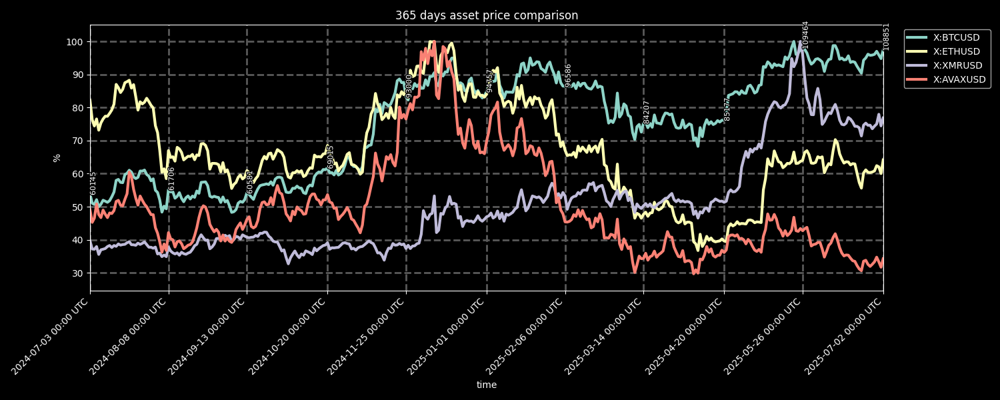
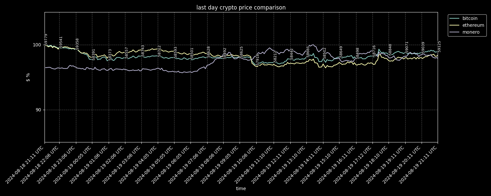
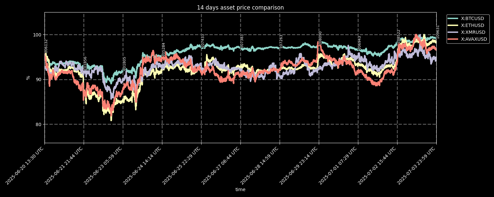
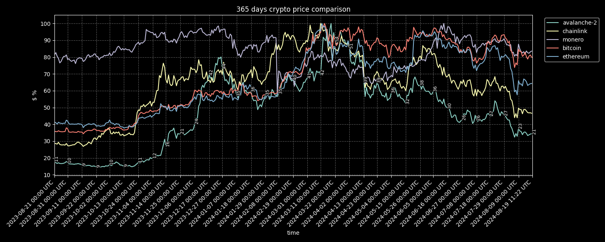

# Purpose #

The purpose of this Discord bot is to pull the prices of user-defined coins from CoinGecko for a user-defined number of last days and display them in a plot in a relative manner.
The prices for the first coin on the list are also shown.

> [!TIP]  
> The images below are updated automagically via Github Actions every hour!

# Usage #

To use the bot, send it a direct message on Discord or post in any channel the bot has access to on a Discord server that the bot is in. The message should conform to the following guidelines.

Default settings (maximum number of days available on CoinGecko, using coins bitcoin, ethereum and monero):
```
!stonks
```
will produce something like:


Default settings with user-defined number of days:
```
!stonks <number of days>
```
for example:
```
!stonks 1
```
will produce something like:

```
!stonks 14
```
will produce something like:


Custom input:
```
!stonks <number of days> <CoinGecko API ids with spaces>
```
for example:
```
!stonks 365 avalanche-2 chainlink monero bitcoin ethereum
```
will produce something like:


# Installation #

* Install latest Python
* Run `pip install -r requirements.txt`

## Running as a Discord bot ##

* Run `python bot.py`

## Running locally ##

* Run `python stonks.py`

> [!NOTE]
> All the commands listed under Usage will work if you substitute `!stonks` with `python stonks.py`, for example
> ```
> python stonks.py 365 avalanche-2 chainlink monero bitcoin ethereum
> ```

# TODO #

* [ ] Automatic deployment to AWS EC2 via GitHub Actions
* [ ] Add stocks + ETFs
* [ ] Overall code quality improvements
