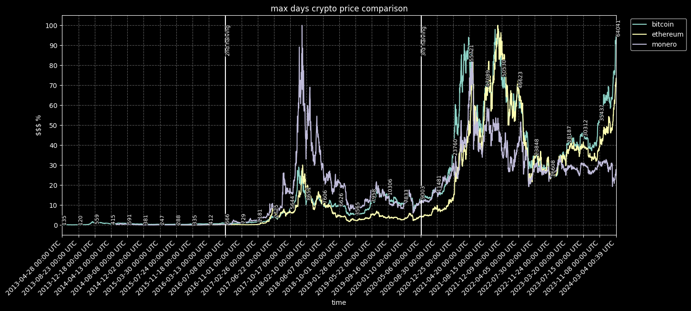
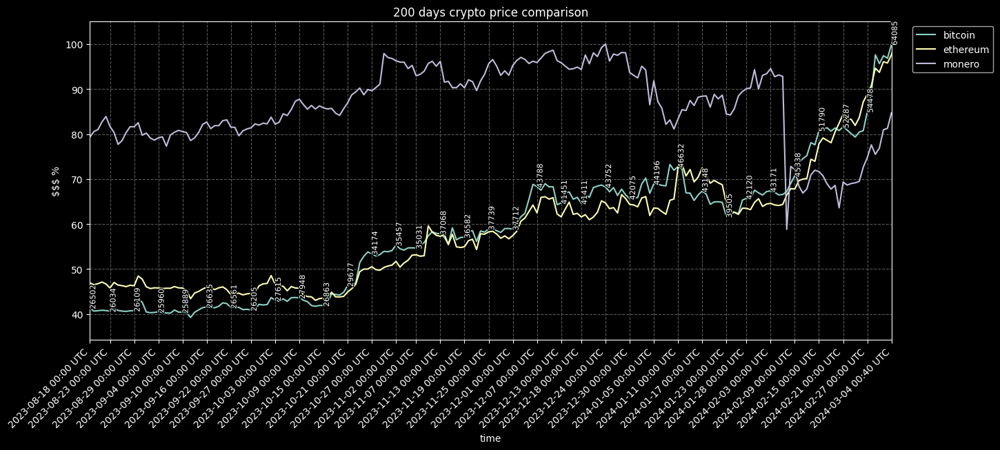
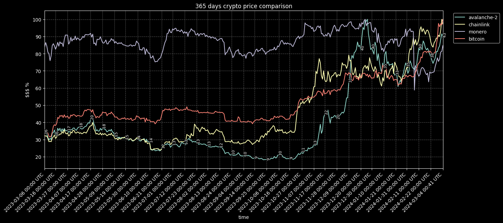

# Purpose #

The purpose of this Discord bot is to pull the prices of user-defined coins from CoinGecko for a user-defined number of last days and display them in a plot in a relative manner.
The bot will also display prices for the first coin on the list.
Bitcoin halvings inside the CoinGecko interval will also be shown as white vertical lines in case bitcoin is on the list.

# Usage #

To use the bot, send it a direct message on Discord or post in any channel the bot has access to on a Discord server that the bot is in. The message should conform to the following guidelines.

Default settings (maximum number of days available on CoinGecko, using coins bitcoin, ethereum and monero):

    !kekw

will produce something like:

Default settings with user-defined number of days:

    !kekw <number of days or max>

for example:

    !kekw 200

will produce something like:

Custom input:

    !kekw <number of days or max> <CoinGecko API ids with spaces>

for example:

    !kekw 365 avalanche-2 chainlink monero bitcoin

will produce something like:

# TODO #

* [ ] Automatic deployment to AWS EC2 via GitHub Actions
* [ ] Add stocks + ETFs
* [ ] Overall code quality improvements
