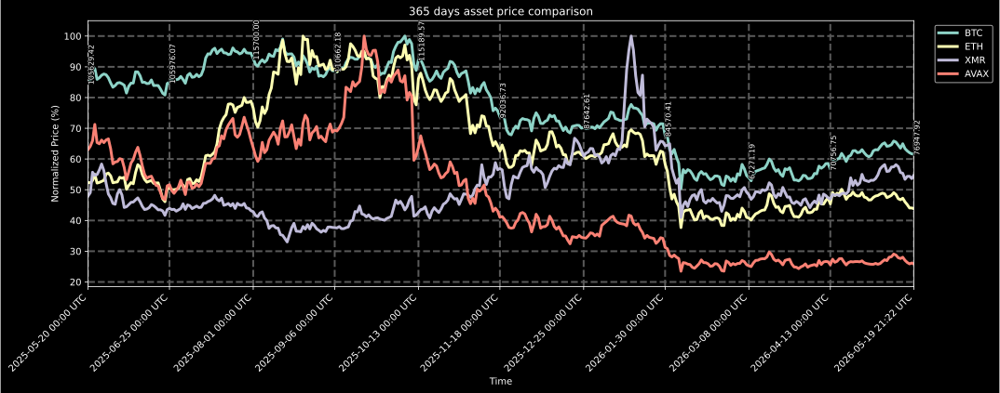
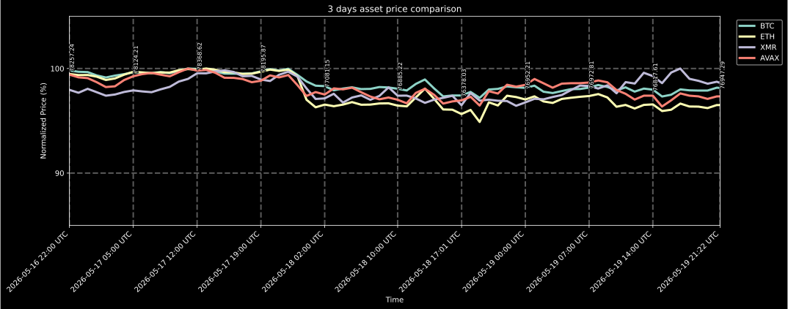
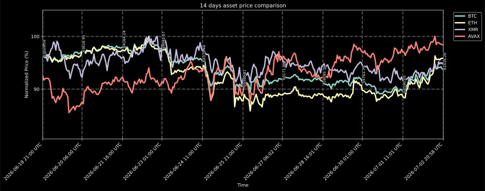
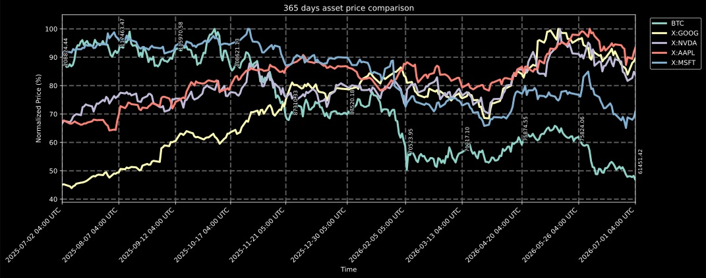

# Preview

> [!NOTE]
> These charts are automagically updated via GitHub Actions every hour.

## Default Portfolio (365 days)
```text
!stonks
```


## Short-term Analysis (3 days)
```text
!stonks 3
```


## Medium-term Analysis (14 days)
```text
!stonks 14
```


## BTC and Major Tech Stocks (365 days)
```text
!stonks 365 BTC X:GOOG X:NVDA X:AAPL X:MSFT
```


## Documentation

- [Usage Guide](USAGE.md) - Commands, local setup, requirements, and features
- [Environment Variables](ENVIRONMENT_VARIABLES.md) - API keys and configuration
- [Deployment Guide](DEPLOYMENT.md) - Railway deployment and troubleshooting
