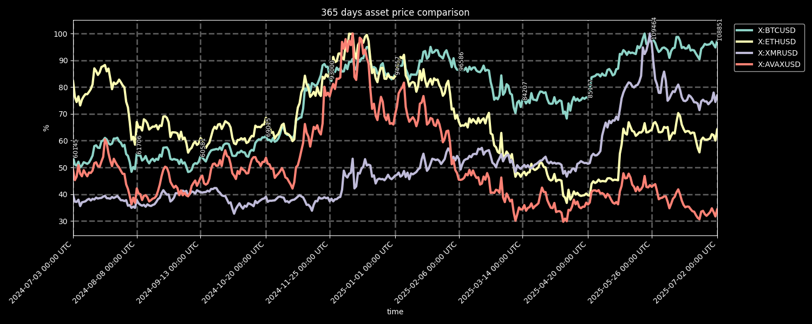
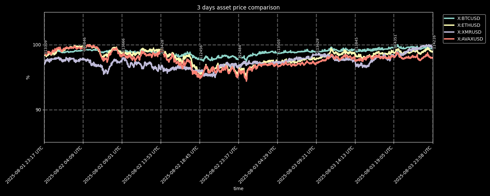
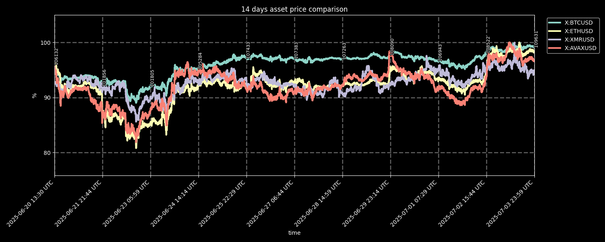
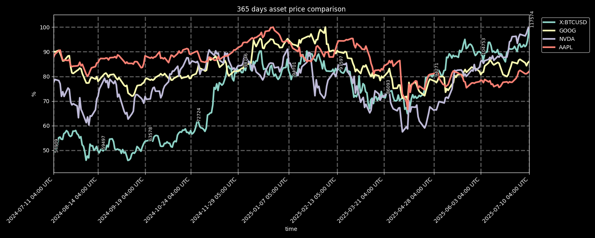

# 📈 Stonks Bot

[](https://www.python.org/downloads/)
[](https://discordpy.readthedocs.io/)
[](https://railway.app/)
[](LICENSE)

> Discord bot that creates price comparison charts for cryptocurrencies and stocks using real-time market data.

## 🚀 Quick Start

**Deploy to Railway (Recommended):**
1. Fork this repository → Get [Discord Bot Token](https://discord.com/developers/applications) & [Polygon.io API Key](https://polygon.io/)
2. `railway up` → Set environment variables in Railway dashboard → Invite bot to server

**Run Locally:**
```bash
git clone https://github.com/aljazfrancic/stonks-bot.git
cd stonks-bot && ./scripts/setup.sh
# Edit .env with your API keys, then: python bot.py
```

## 🔧 Setup

**Environment Variables:**
```bash
DISCORD_TOKEN=your_discord_bot_token
POLYGON=your_polygon_api_key
```

**Scripts:**
- `./scripts/setup.sh` - Quick local setup
- `./scripts/deploy.sh` - Deploy to Railway

## 📖 Usage

To use the bot, send it a direct message on Discord or post in any channel the bot has access to on a Discord server that the bot is in. The message should conform to the following guidelines.

### Default settings (365 days, using tickers `X:BTCUSD`, `X:ETHUSD`, `X:XMRUSD`, `X:AVAXUSD`):
```
!stonks
```
will produce:


### Default settings with user-defined number of days:
```
!stonks <number of days>
```
for example:
```
!stonks 3
```
will produce:

```
!stonks 14
```
will produce:


### Custom input:
```
!stonks <number of days> <tickers with spaces>
```
for example:
```
!stonks 365 X:BTCUSD GOOG NVDA AAPL
```
will produce:


> **Tip:** You can mix stock and cryptocurrency [tickers](https://polygon.io/quote/tickers) in the same command.


Navigation Menu
stonks-bot

Code
Issues
Pull requests
Commit e5ac8bb
aljazfrancic
aljazfrancic
authored
2 minutes ago
·
·
Verified
Update README.md
main
1 parent 
32e88ad
 commit 
e5ac8bb
1 file changed
Search within code
 
‎README.md
-10
Lines changed: 0 additions & 10 deletions


Original file line number	Diff line number	Diff line change
@@ -72,16 +72,6 @@ will produce:

> **Tip:** You can mix stock and cryptocurrency [tickers](https://polygon.io/quote/tickers) in the same command.

## 📁 Docs

- [Deployment Guide](DEPLOYMENT.md)

## 📝 TODO

- [ ] Revert back to CoinGecko
- [ ] Overall code quality improvements

---
**Need help?** [Open an issue](https://github.com/aljazfrancic/stonks-bot/issues) • [Full docs](DEPLOYMENT.md)
