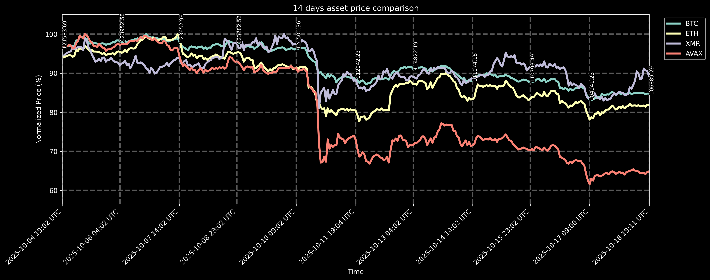

# 📈 Stonks Bot

[](https://www.python.org/downloads/)
[](https://discordpy.readthedocs.io/)
[](https://railway.app/)
[](LICENSE)

> Advanced Discord bot that creates price comparison charts for cryptocurrencies and stocks using real-time market data from multiple APIs.

## 🚀 Quick Start

**Deploy to Railway (Recommended):**
1. Fork this repository → Get [Discord Bot Token](https://discord.com/developers/applications) & [Polygon.io API Key](https://polygon.io/)
2. `railway up` → Set environment variables in Railway dashboard → Invite bot to server

**Run Locally:**
```bash
git clone https://github.com/aljazfrancic/stonks-bot.git
cd stonks-bot && ./scripts/setup.sh
# Edit .env with your API keys, then: python bot.py
```

## 🔧 Setup

**Environment Variables:**
```bash
DISCORD_TOKEN=your_discord_bot_token
POLYGON=your_polygon_api_key
ENVIRONMENT=development  # Optional: development/production
LOG_LEVEL=INFO          # Optional: DEBUG/INFO/WARNING/ERROR
```

**Scripts:**
- `./scripts/setup.sh` - Quick local setup
- `./scripts/deploy.sh` - Deploy to Railway

## 🤖 Deployment

- [Deployment Guide](DEPLOYMENT.md)
- [Environment Variables Guide](ENVIRONMENT_VARIABLES.md)

## 🔄 CI/CD Behavior

The GitHub Actions workflow automatically updates the stonks images every hour. **Smart Commit Management:**

- **If the last commit is a chore commit** (autopublish): Automatically amends the existing commit instead of creating new ones
- **If the last commit is not a chore commit**: Creates a new commit as usual

This keeps the git history clean by consolidating all autopublish updates into single commits, preventing the repository from being cluttered with hundreds of individual chore commits.

## 🌟 Features

### 🔗 **Multi-API Support**
- **Polygon.io**: Stocks and major cryptocurrencies (requires API key)
- **CoinGecko**: 1000+ cryptocurrencies (free, no API key required)
- **Automatic Provider Selection**: Bot automatically chooses the best API based on ticker format

### 📊 **Enhanced Chart Quality**
- High-resolution charts (300 DPI)
- Better error handling and user feedback
- Improved chart styling and readability
- Support for up to 10 tickers simultaneously

### 🛡️ **Robust Error Handling**
- Comprehensive error messages
- Rate limiting protection
- Network error recovery
- Input validation

### ⚙️ **Configuration Management**
- Centralized configuration file
- Environment-based settings
- Easy customization without code changes

## 📖 Usage

> [!NOTE]
> The following graphs are automagically updated via GitHub Actions, so we're looking at the latest data available without paying any subscriptions.

To use the bot, send it a direct message on Discord or post in any channel the bot has access to on a Discord server that the bot is in.

> [!TIP]
> You can mix stock and cryptocurrency tickers in the same command! Use `X:SYMBOL` for stocks/Polygon data and `SYMBOL` for CoinGecko cryptocurrencies.

### **Default Settings (365 days)**
```
!stonks
```
Uses default mixed portfolio: `BTC`, `ETH`, `XMR`, `AVAX`


### **Custom Time Periods**
```
!stonks 3    # Last 3 days
!stonks 14   # Last 2 weeks
!stonks 30   # Last month
!stonks 365  # Last year
```

**3-day chart:**


**14-day chart:**


### **Featured Chart Examples**

**BTC and Major Stocks Portfolio (365 days):**
```
!stonks 365 BTC X:GOOG X:NVDA X:AAPL
```
This combination showcases Bitcoin alongside major tech stocks for a comprehensive view of tech and crypto markets.


### **Custom Ticker Combinations**

**Stocks only:**
```
!stonks 30 X:GOOG X:NVDA X:AAPL X:MSFT
```

**Cryptocurrencies only:**
```
!stonks 7 BTC ETH SOL ADA DOT
```

**Mixed portfolio:**
```
!stonks 90 X:BTCUSD ETH X:GOOG X:NVDA
```

### **Supported Ticker Formats**

**Polygon.io (Stocks & Major Crypto):**
- `X:BTCUSD` - Bitcoin
- `X:ETHUSD` - Ethereum  
- `X:GOOG` - Google
- `X:AAPL` - Apple
- `X:NVDA` - NVIDIA

**CoinGecko (Cryptocurrencies):**
- `BTC` - Bitcoin
- `ETH` - Ethereum
- `SOL` - Solana
- `ADA` - Cardano
- `DOT` - Polkadot
- `MATIC` - Polygon
- `UNI` - Uniswap
- And 1000+ more!

## 🧪 Testing

Run the comprehensive test suite:

```bash
python test_stonks.py
```

Tests cover:
- Data provider functionality
- Chart generation
- Error handling
- Configuration management
- Input validation

## 📁 Project Structure

```
stonks-bot/
├── stonks.py          # Core chart generation logic
├── bot.py             # Discord bot implementation
├── config.py          # Configuration management
├── test_stonks.py     # Test suite
├── github_actions.py  # CI/CD automation
├── .github/           # GitHub Actions workflows
├── pics/              # Generated charts
└── scripts/           # Deployment scripts
```

## 🔧 Development

### **Code Quality Improvements**
- **Type Hints**: Full Python type annotations
- **Error Handling**: Comprehensive exception management
- **Logging**: Structured logging throughout
- **Documentation**: Detailed docstrings and comments
- **Testing**: Unit tests with mocking
- **Configuration**: Centralized, environment-aware config

### **Architecture**
- **Provider Pattern**: Abstract data providers for different APIs
- **Singleton Pattern**: Efficient chart instance management
- **Separation of Concerns**: Clear separation between data, logic, and presentation
- **Async Support**: Full async/await support for Discord bot

## 📝 TODO

- [x] Squash existing and future chore commits
- [x] Combine CoinGecko and Polygon tickers
- [x] Overall code quality improvements
- [ ] Add more chart customization options
- [ ] Implement caching for API responses
- [ ] Add support for more time intervals (hours, weeks, months)
- [ ] Create web dashboard for chart viewing
