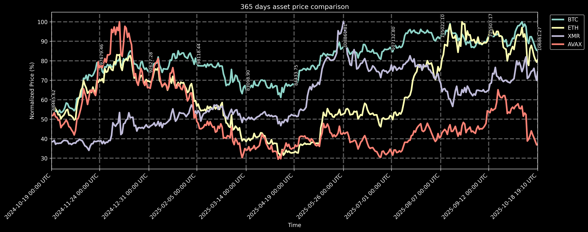

# Purpose #

The purpose of this Discord bot is to pull the close prices for user-defined list of assets (cryptocurrencies, stocks, etc.) for a select number of last days and display them in a plot in a relative manner.

The close prices for the first asset on the list are also shown.

> [!NOTE]  
> The images below are updated automagically via GitHub Actions every hour!

# Usage #

To use the bot, send it a direct message on Discord or post in any channel the bot has access to on a Discord server that the bot is in. The message should conform to the following guidelines.

Default settings (365 days, using tickers `X:BTCUSD`, `X:ETHUSD`, `X:XMRUSD`, `X:AVAXUSD`):
```
!stonks
```
will produce:


Default settings with user-defined number of days:
```
!stonks <number of days>
```
for example:
```
!stonks 3
```
will produce:

```
!stonks 14
```
will produce:


Custom input:
```
!stonks <number of days> <tickers with spaces>
```
for example:
```
!stonks 365 X:BTCUSD GOOG NVDA AAPL
```
will produce:


> [!TIP]  
> In terms of [tickers](https://polygon.io/quote/tickers), mixing cryptocurrencies and stocks is allowed!

# Installation #

* Install latest Python
* Run `pip install -r requirements.txt`

# Deployment (Railway)

See the section below for full Railway deployment instructions.

---

# Deploy Discord Bot on Railway

This guide will walk you through deploying the stonks Discord bot on Railway, a modern platform for deploying applications.

## Prerequisites

Before you begin, make sure you have:

- A [Railway account](https://railway.app/)
- A [Discord application and bot token](https://discord.com/developers/applications)
- A [Polygon.io API key](https://polygon.io/) (free tier available)
- Your bot code ready in a Git repository

## Step 1: Prepare Your Repository

Ensure your repository contains the following files:

```
stonks-bot/
├── bot.py              # Main Discord bot file
├── stonks.py           # Stock data processing logic
├── requirements.txt    # Python dependencies
├── .env.example        # Environment variables template
└── README.md           # Project documentation
```

## Step 2: Create Environment Variables Template

Create a `.env.example` file in your repository root:

```bash
# Discord Bot Token
DISCORD_TOKEN=your_discord_bot_token_here

# Polygon.io API Key
POLYGON=your_polygon_api_key_here
```

## Step 3: Deploy to Railway

### Option A: Deploy via Railway Dashboard

1. **Connect Repository**
   - Go to [Railway Dashboard](https://railway.app/dashboard)
   - Click "New Project"
   - Select "Deploy from GitHub repo"
   - Choose your repository

2. **Configure Environment Variables**
   - In your Railway project dashboard, go to the "Variables" tab
   - Add the following environment variables:
     - `DISCORD_TOKEN`: Your Discord bot token
     - `POLYGON`: Your Polygon.io API key

3. **Configure Build Settings**
   - Railway will automatically detect this as a Python project
   - The build command will be: `pip install -r requirements.txt`
   - The start command should be: `python bot.py`

### Option B: Deploy via Railway CLI

1. **Install Railway CLI**
   ```bash
   npm install -g @railway/cli
   ```

2. **Login to Railway**
   ```bash
   railway login
   ```

3. **Initialize Railway Project**
   ```bash
   railway init
   ```

4. **Set Environment Variables**
   ```bash
   railway variables set DISCORD_TOKEN=your_discord_bot_token_here
   railway variables set POLYGON=your_polygon_api_key_here
   ```

5. **Deploy**
   ```bash
   railway up
   ```

## Step 4: Configure Discord Bot

1. **Create Discord Application**
   - Go to [Discord Developer Portal](https://discord.com/developers/applications)
   - Click "New Application"
   - Give it a name (e.g., "Stonks Bot")

2. **Create Bot**
   - Go to the "Bot" section in your application
   - Click "Add Bot"
   - Copy the bot token and add it to Railway environment variables

3. **Set Bot Permissions**
   - In the Bot section, enable these permissions:
     - Send Messages
     - Attach Files
     - Read Message History
     - Use Slash Commands (if implementing slash commands)

4. **Invite Bot to Server**
   - Go to "OAuth2" → "URL Generator"
   - Select "bot" scope
   - Select the permissions mentioned above
   - Use the generated URL to invite the bot to your server

## Step 5: Verify Deployment

1. **Check Railway Logs**
   - In Railway dashboard, go to your deployment
   - Check the logs to ensure the bot started successfully
   - You should see: `{bot_name} reporting for duty!`

2. **Test Bot Commands**
   In your Discord server, try these commands:
   ```
   !stonks
   !stonks 7
   !stonks 30 X:BTCUSD GOOG NVDA
   ```

## Step 6: Monitor and Maintain

### Railway Dashboard Monitoring
- **Logs**: Monitor application logs in real-time
- **Metrics**: Track CPU, memory, and network usage
- **Deployments**: View deployment history and rollback if needed

### Environment Variables Management
- Update environment variables through Railway dashboard
- Use Railway CLI: `railway variables set VARIABLE_NAME=value`

### Scaling (if needed)
- Railway automatically scales based on traffic
- For high-traffic bots, consider upgrading to a paid plan

## Troubleshooting

### Common Issues

1. **Bot Not Responding**
   - Check Railway logs for errors
   - Verify `DISCORD_TOKEN` is correct
   - Ensure bot has proper permissions

2. **API Rate Limits**
   - Polygon.io free tier has rate limits
   - Consider upgrading to paid plan for higher limits

3. **Build Failures**
   - Check `requirements.txt` for correct dependencies
   - Ensure all files are committed to repository

4. **Environment Variables Not Set**
   - Verify variables are set in Railway dashboard
   - Check variable names match exactly (case-sensitive)

### Debug Commands

```bash
# Check Railway status
railway status

# View logs
railway logs

# Restart deployment
railway up
```

## Security Best Practices

1. **Never commit sensitive data**
   - Keep `.env` files in `.gitignore`
   - Use Railway environment variables for secrets

2. **Regular token rotation**
   - Periodically regenerate Discord bot tokens
   - Update Railway environment variables accordingly

3. **Monitor usage**
   - Track API usage to avoid rate limits
   - Monitor bot activity for unusual patterns

## Cost Considerations

- **Railway Free Tier**: Limited usage, suitable for development
- **Railway Pro**: $5/month for more resources
- **Polygon.io**: Free tier available, paid plans for higher limits

## Additional Resources

- [Railway Documentation](https://docs.railway.app/)
- [Discord.py Documentation](https://discordpy.readthedocs.io/)
- [Polygon.io API Documentation](https://polygon.io/docs/)

# TODO #

* [ ] Revert back to CoinGecko
* [ ] Add Discord Application guide to `README.md`
* [ ] Automatic deployment to AWS EC2 via GitHub Actions
* [ ] Overall code quality improvements
