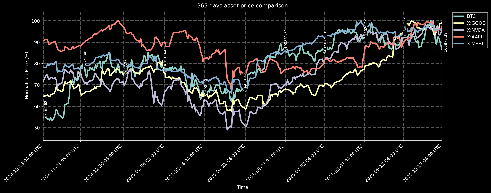

# 🤖 Stonks Bot 

Discord bot that creates real-time price comparison charts for cryptocurrencies and stocks

[](https://www.python.org/downloads/)
[](https://discordpy.readthedocs.io/)
[](https://railway.app/)
[](LICENSE)

## 🔎 Preview

> [!NOTE]
> These charts are automagically updated via GitHub Actions every hour.

### Default Portfolio (365 days)
```text
!stonks
```


### Short-term Analysis (3 days)
```text
!stonks 3
```


### Medium-term Analysis (14 days)
```text
!stonks 14
```


### BTC and Major Tech Stocks (365 days)
```text
!stonks 365 BTC X:GOOG X:NVDA X:AAPL X:MSFT
```


## ⚡ Quick Start

### Deploy to Railway (Recommended)
1. Fork this repository
2. Get your API keys:
   - [Discord Bot Token](https://discord.com/developers/applications) (required)
   - [Polygon.io API Key](https://polygon.io/) (required for stocks, free tier available)
   - [CoinGecko API Key](https://www.coingecko.com/en/api) (optional - for higher crypto rate limits)
3. Run `railway up` and set environment variables in Railway dashboard
4. Invite bot to your Discord server

### Run Locally
```bash
git clone https://github.com/aljazfrancic/stonks-bot.git
cd stonks-bot && ./scripts/setup.sh
# Edit .env with your API keys:
# DISCORD_TOKEN=your_token
# POLYGON=your_polygon_key
# COINGECKO=your_coingecko_key
python bot.py
```

## 🎯 How to Use

### Basic Commands
```bash
!stonks                   # Default portfolio (BTC, ETH, XMR, AVAX)
!stonks 7                 # 7-day chart
!stonks 30 BTC ETH        # 30-day BTC/ETH chart
!stonks 365 X:AAPL X:MSFT # 1-year Apple/Microsoft chart
```

### Supported Tickers
- **Cryptocurrencies**: `BTC`, `ETH`, `SOL` (via CoinGecko)
- **Stocks**: `X:AAPL`, `X:MSFT`, `X:GOOG` (via Polygon.io)

## 🔧 Configuration

### Environment Variables

**Required:**
- `DISCORD_TOKEN` - Get from [Discord Developer Portal](https://discord.com/developers/applications)
- `POLYGON` - Get from [Polygon.io](https://polygon.io/) (free tier available)

**Optional:**
- `COINGECKO` - Get from [CoinGecko API](https://www.coingecko.com/en/api) (for higher crypto rate limits)
- `LOG_LEVEL` - Options: `DEBUG`, `INFO`, `WARNING`, `ERROR` (default: `INFO`)
- `ENVIRONMENT` - Options: `development`, `production` (default: `development`)

```bash
# .env example
DISCORD_TOKEN=your_discord_bot_token
POLYGON=your_polygon_api_key
COINGECKO=your_coingecko_api_key   # Optional
LOG_LEVEL=INFO                     # Optional
ENVIRONMENT=production             # Optional
```

### Requirements
- Python 3.12 or higher
- Discord Bot Token
- Polygon.io API Key
- CoinGecko API Key (optional)

See [ENVIRONMENT_VARIABLES.md](ENVIRONMENT_VARIABLES.md) for detailed setup instructions.

## 🚂 Deployment

```bash
# Deploy to Railway (Recommended)
railway login
railway up
```

See [DEPLOYMENT.md](DEPLOYMENT.md) for detailed instructions.

## 🧪 Testing

```bash
python test_stonks.py
```

## 🌟 Features

- Multi-API support (Polygon.io + CoinGecko)
- Automatic provider selection
- Comprehensive error handling
- Rate limit protection
- Auto-updating demo charts (hourly)

## 🔍 Troubleshooting

| Issue | Solution |
|-------|----------|
| No data available | Check ticker symbol or try different time period |
| Rate limited | Wait and try again, or add CoinGecko API key |
| Invalid ticker | Use `X:SYMBOL` for stocks, `SYMBOL` for crypto |
| Bot not responding | Check Railway logs, verify `DISCORD_TOKEN` |

## 📚 Documentation

- [Discord.py Documentation](https://discordpy.readthedocs.io/)
- [Polygon.io API Docs](https://polygon.io/docs/)
- [CoinGecko API Docs](https://www.coingecko.com/en/api/documentation)
- [Railway Documentation](https://docs.railway.app/)
- [Deployment Guide](DEPLOYMENT.md)
