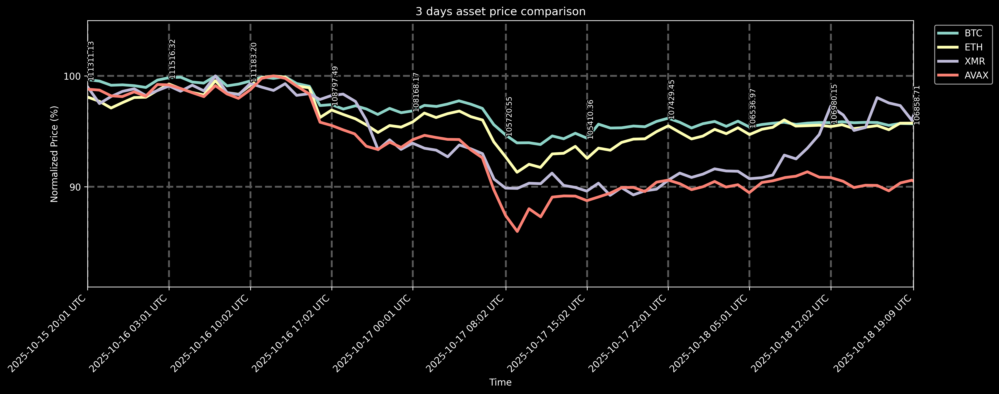

# Purpose #

The purpose of this Discord bot is to pull the close prices for user-defined list of assets (cryptocurrencies, stocks, etc.) for a select number of last days and display them in a plot in a relative manner.

The close prices for the first asset on the list are also shown.

> [!NOTE]  
> The images below are updated automagically via GitHub Actions every hour!

# Usage #

To use the bot, send it a direct message on Discord or post in any channel the bot has access to on a Discord server that the bot is in. The message should conform to the following guidelines.

Default settings (365 days, using tickers `X:BTCUSD`, `X:ETHUSD`, `X:XMRUSD`):
```
!stonks
```
will produce:


Default settings with user-defined number of days:
```
!stonks <number of days>
```
for example:
```
!stonks 3
```
will produce:

```
!stonks 14
```
will produce:


Custom input:
```
!stonks <number of days> <tickers with spaces>
```
for example:
```
!stonks 365 X:BTCUSD GOOG NVDA AAPL
```
will produce:


> [!TIP]  
> In terms of [tickers](https://polygon.io/quote/tickers), mixing cryptocurrencies and stocks is allowed!

# Installation #

* Install latest Python
* Run `pip install -r requirements.txt`

## Running as a Discord bot ##

* Run `python bot.py`

## Running locally ##

> [!IMPORTANT]
> All the Discord commands listed under [Usage](#usage) will work locally if you `cd` into project location and substitute `!stonks` with `python stonks.py`!
>
> However, for this to work, you must provide a [polygon.io](https://polygon.io/) API key, which you can acquire for free on their website.
> Then create a file named `.env` and paste your polygon API `<key>` into it like so:
> ```
> POLYGON=<key>
> ```

* Run `python stonks.py`

With some additional parameters:
> ```
> python stonks.py 365 X:BTCUSD GOOG NVDA AAPL
> ```

# TODO #

* [ ] Add Discord Application guide to `README.md`
* [ ] Automatic deployment to AWS EC2 via GitHub Actions
* [ ] Overall code quality improvements
